# Material Intelligence

### Procedural Knitting, Simulation & Machine Perception in Houdini

**Toward a common sensory language for AI and robotics.**

> **What if machines do not need to perceive the physical world the way humans do?**
>
> **What is the common language of perception for AI?**
>
> David Eagleman's [work on sensory substitution](https://pubmed.ncbi.nlm.nih.gov/36712151/) shows something remarkable: change the input channel and spatial information can be learned through the tongue or skin, without ever needing the eyes.
>
> **Could changes in matter themselves become a sensory language?**
>
> This project reconstructs yarn and knitted materials from the fiber level up, then simulates tension, compression, stretching, friction, deformation, unraveling, tearing and failure.
>
> The goal is to test what an intelligent system can infer from those physical changes.
>
> For robotics, that opens another channel for perception: learning from how matter responds to interaction.

This repository is a material-simulation study and a proposal for a machine-perception experiment. It does not train a perception model, infer physical parameters from camera footage, or claim sim-to-real validation. Its contribution is the controllable material substrate: fibers, paths, contacts, constraints and failures that can be changed, observed and measured.

**Technical progression:** fiber → yarn → yarn systems → knitting and fabric construction → real-world comparison → simulation → deformation and failure → machine perception.

---

## Contents

- [01 — Material as a perceptual channel](#01--material-as-a-perceptual-channel)
- [02 — Reconstructing yarn from the fiber upward](#02--reconstructing-yarn-from-the-fiber-upward)
- [03 — Yarn systems and infinity form](#03--yarn-systems-and-infinity-form)
- [04 — Knitting, loops and fabric construction](#04--knitting-loops-and-fabric-construction)
- [05 — Yarn-ball systems and material variation](#05--yarn-ball-systems-and-material-variation)
- [06 — Real material and simulated structure](#06--real-material-and-simulated-structure)
- [07 — Deformation as an experiment](#07--deformation-as-an-experiment)
- [08 — Failure and changing topology](#08--failure-and-changing-topology)
- [09 — From spatial intelligence to material intelligence](#09--from-spatial-intelligence-to-material-intelligence)
- [Toward Adam 2.0](#toward-adam-20)
- [Technical notebook](#technical-notebook)
- [Opening the files](#opening-the-files)
- [Media provenance](#media-provenance)

---

## 01 — Material as a perceptual channel

A camera records appearance. Interaction exposes behavior.

When a robot pulls a strand, compresses a ball, drags fabric or begins a tear, the material returns a time-varying signal. Shape changes. Resistance rises or drops. Contact shifts. Fibers slip. Constraints stretch or break. The object may preserve its topology, or become a different connected object.

The working hypothesis is that these responses could form a learnable sensory language.

| Candidate channel | Observable change | Possible inference |
|---|---|---|
| RGB or depth | silhouette, fold, occlusion, displacement | pose and visible geometry |
| force, torque or motor load | resistance over time | compliance, support and impending release |
| vibration or sound | transient frequency patterns | slip, impact or tear onset |
| tracked deformation | strain, relaxation and hysteresis | stiffness and recovery behavior |
| topology state | lost constraints, new edges and fragments | damage and the next safe action |

The current Houdini scenes expose geometry, constraints, deformation and topology. Force/torque, vibration, sound and synchronized real-world sensing are the next experimental layer.

---

## 02 — Reconstructing yarn from the fiber upward

The study begins with a reconstruction problem: what structure must exist before yarn can return a meaningful physical response?

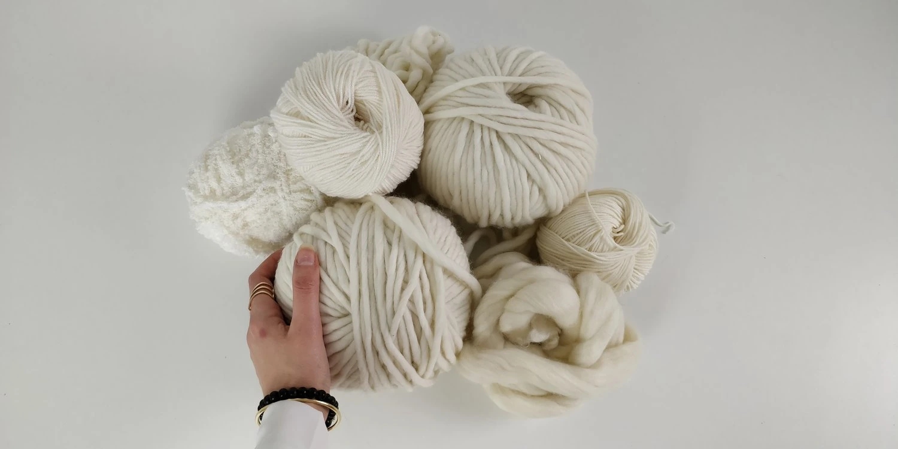

<sub><strong>Material reference.</strong> Changes in strand diameter, twist, packing and loose fiber define the reconstruction problem before any procedural geometry is built.</sub>


<sub><strong>Figure 02.1 — Strand construction.</strong> Nested twist remains legible from the individual ply to the packed yarn bundle.</sub>

The construction is hierarchical:

1. A guide curve defines the material path.
2. Copies form a strand bundle around that path.
3. resampling controls segment length before each expansion.
4. PolyFrame supplies a stable local frame.
5. nested sweeps create strand and fiber volume.
6. stochastic groups introduce several scales of irregularity.
7. pruning and rendering reduce the visible output to the required scale.

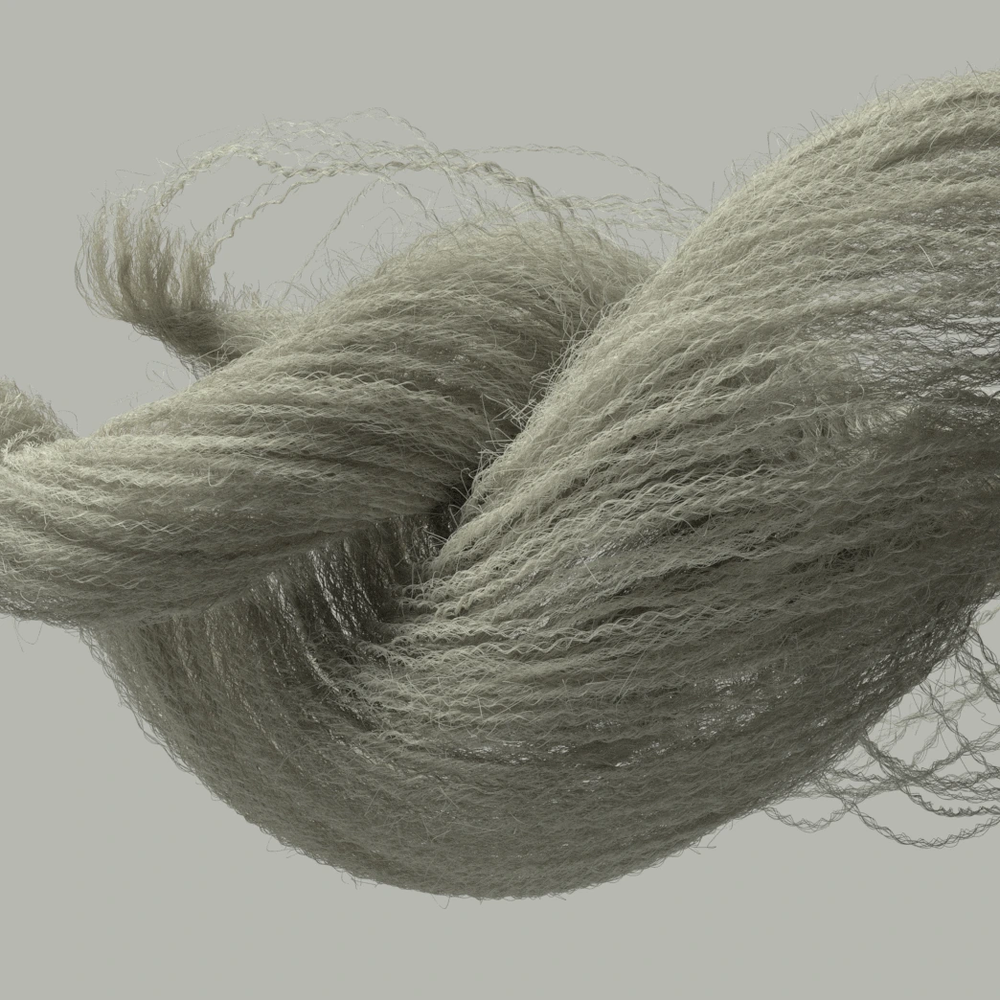

<sub><strong>Figure 02.2 — Fiber-rich output.</strong> Fine strands, clumping and flyaways remain explicit at render scale.</sub>

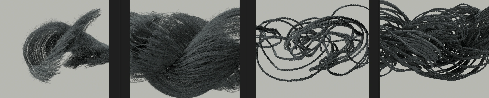

<sub><strong>Figure 02.3 — Threading and construction.</strong> Project renders move between dense fiber populations, coherent twist and open interlacing.</sub>

The base strand displacement in `/obj/thread7/attribwrangle5` is explicit:

```c
float twistAmount = ch("twist_amount");
float freq = ch("frequency");
float amp = ch("amplitude");

vector pos = @P;
float angle = freq * pos.y;
pos.x += amp * sin(angle + twistAmount);
pos.z += amp * cos(angle + twistAmount);
@P = pos;
```

In the inspected V7 scene, `frequency = 0.168` and `amplitude = 0.02`. The source line has 500 points; Bend closes it through 360°, and a second Bend applies −360° of twist. `copy1` is animated from 50 copies at frame 1 to 200 at frame 72.

`PolyFrame3` writes the tangent to `N` and the second frame vector to `up`. That frame keeps the sweep cross-section oriented along a curved guide. A visual twist can be shaded; a force-bearing strand needs a consistent path and frame.

---

## 03 — Yarn systems and infinity form

Once one strand is stable, the system expands into hanks, continuous loops and infinity-yarn arrangements.


<sub><strong>Figure 03.1 — Strand system.</strong> Color separates the procedural populations before shading and makes packing, continuity and crossings inspectable.</sub>

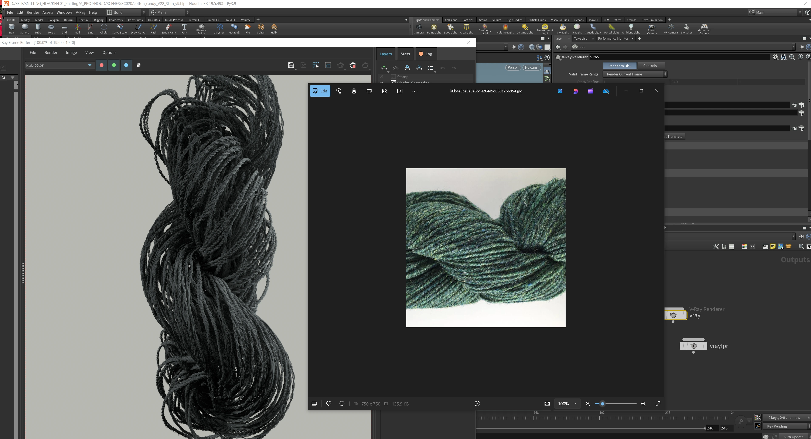

<sub><strong>Figure 03.2 — Form-specific reference.</strong> The supplied green hank appears beside the procedural infinity-yarn render used to study loop proportion, bundle density and twist direction.</sub>

<table width="100%">
  <tr>
    <td width="50%" valign="top"></td>
    <td width="50%" valign="top">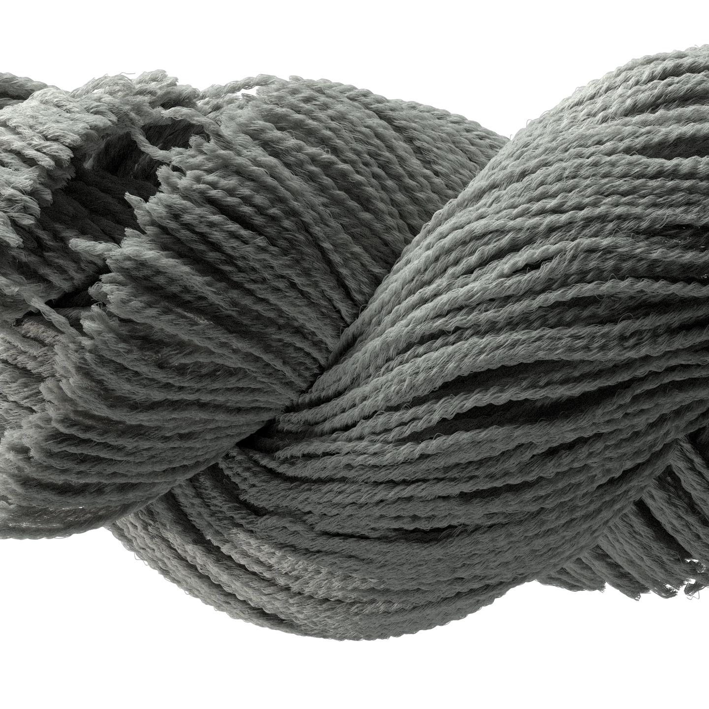</td>
  </tr>
  <tr>
    <td width="50%" valign="top"></td>
    <td width="50%" valign="top"></td>
  </tr>
</table>

<sub><strong>Fiber-resolution progression.</strong> Successive frames compare strand definition, surface density, flyaway structure and the balance between coherent twist and fiber breakup.</sub>

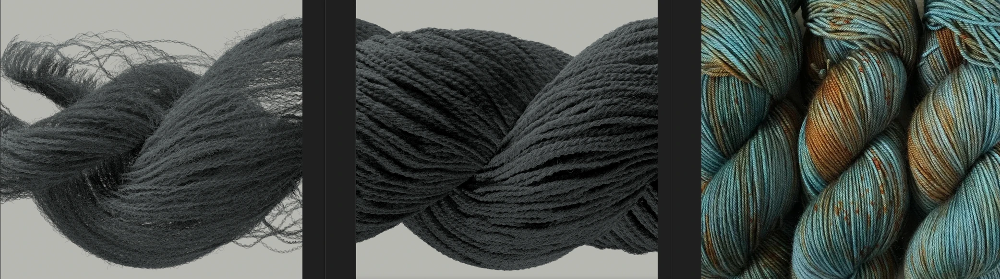

<sub><strong>Figure 03.4 — Infinity-yarn comparison.</strong> Two procedural reconstructions at left; the supplied real hank reference at right.</sub>

<table width="100%">
  <tr>
    <td width="50%" valign="top"></td>
    <td width="50%" valign="top">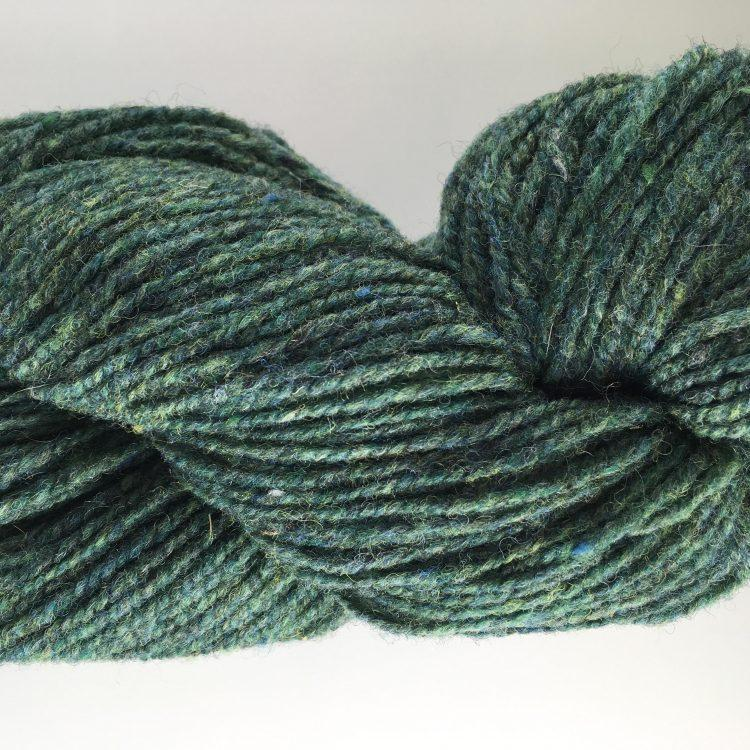</td>
  </tr>
</table>

<sub><strong>Twist and packing study.</strong> Equal-scale procedural and physical views compare bundle direction, compression, surface fibers and the legibility of individual plies.</sub>

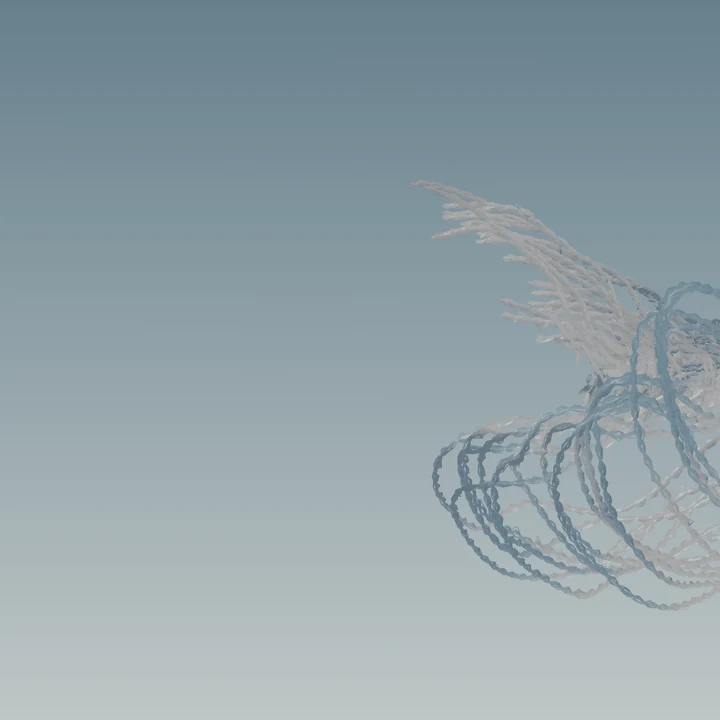

<sub><strong>Figure 03.5 — Construction over time.</strong> The source playblast reveals how repeated paths accumulate into a yarn system.</sub>

The same yarn cannot be represented at full fiber density for every task. The scenes separate the light structure that is animated or solved from the denser geometry used to communicate the surface.

| Stage in the inspected V7 graph | Points | Primitives | Role |
|---|---:|---:|---|
| `line2` | 500 | 1 | source path |
| `copy1` | 25,000 | 50 | repeated strand guides at frame 1 |
| `sweep8` | 52,800 | 1,200 | first volumetric bundle |
| `sweep18` | 145,224 | 17,424 | 36-column nested sweep |
| `sweep20` | 1,161,792 | 139,392 | eight-column secondary sweep |
| `Out_Yarnad` | 277,891 | 33,630 | pruned output at frame 1 |

`sweep18` uses 36 columns, a radius of about `0.005833`, and 720 full twists. `sweep20` uses eight columns, radius `0.004`, and −720 full twists. Resample lengths step from `0.022` to `0.01` and finally `0.008`; the three-yarn scene reaches `0.006`.


<sub><strong>Figure 03.6 — Expansion cost.</strong> The original debug capture reports 26,127,929 points at `/obj/thread7/merge4`.</sub>

That 26.1-million-point state is evidence, not a recommended final representation. For rendering, explicit fibers can create breakup, occlusion and shadowing. For simulation or robotics, guide paths, contact structure and material state may carry more useful information at a fraction of the cost.

The real question is task-dependent: which structure must remain explicit for the response being measured?

---

## 04 — Knitting, loops and fabric construction

Yarn appearance can be built from nested curves. Knitted behavior depends on how those paths interlock.


<sub><strong>Figure 04.1 — Procedural knit / loop study.</strong> Repeated yarn paths form a continuous field of crossings, openings and interlocked loops.</sub>


<sub><strong>Figure 04.2 — Local structure.</strong> The original geometry view exposes crossings, gaps, loop continuation and the smaller strands wrapped around each path.</sub>

<table width="100%">
  <tr>
    <td width="50%" valign="top"></td>
    <td width="50%" valign="top"></td>
  </tr>
</table>

<sub><strong>Figure 04.3 — Material legibility.</strong> Matched camera and scale isolate the effect of alternating and light material treatments.</sub>

The compact [`04_Dynamic_Knitting_Grid_Prototype.hip`](./04_Dynamic_Knitting_Grid_Prototype.hip) is an earlier layout prototype. Its cooked graph creates a 20 × 20 grid, scatters 400 targets, copies 400 separate three-point curves, lifts alternating rows and converts them with PolyWire.

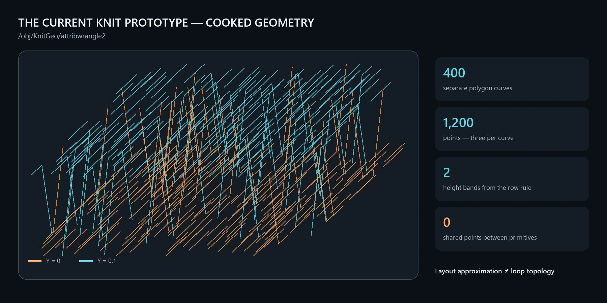

<sub><strong>Figure 04.4 — Cooked prototype geometry.</strong> The prototype has 1,200 curve points and 400 separate primitives before PolyWire; there are no shared loop points to transmit force between stitches.</sub>

The active row rule is:

```c
float row = floor(@ptnum / 10);
if (int(row) % 2 == 0) {
    @P.y += 0.1;
}
```

A force-transmitting stitch representation would need persistent strand identity, ordered loop paths, contact pairs, frictional state and constraints that can slide, tighten, release and break. Those hidden relationships matter to a robot because the same visible fold can produce different resistance depending on how the yarn is connected.


<sub><strong>Figure 04.5 — Related interlacing experiment.</strong> This woven/interlaced field tests repetition, crossing density and local strand construction; it is distinct from the knit-loop system above.</sub>

The close-up render scene, [`04_Cached_Knit_Lace_and_Wool_Ball_Render_Setup.hip`](./04_Cached_Knit_Lace_and_Wool_Ball_Render_Setup.hip), is not self-contained. Its three lace objects reference external `.bgeo.sc` caches, and several wool-ball branches reference external `.fbx` meshes. The supplied screenshots preserve the visual result, but the missing caches prevent a clean reconstruction from that HIP alone.

---

## 05 — Yarn-ball systems and material variation

The ball studies test two related representations: long twisted yarn wrapped into a volume, and a lighter support object carrying dense surface fibers.


<sub><strong>Figure 05.1 — Wrapped-yarn system.</strong> Long twisted strands remain readable across the finished ball volume.</sub>


<sub><strong>Figure 05.2 — Procedural setup.</strong> The viewport, spiral-path code and node graph connect the finished volume to its construction logic.</sub>


<sub><strong>Construction study.</strong> The sequence moves from support geometry and strand organization through per-thread variation to a coherent wrapped-yarn volume.</sub>

<table width="100%">
  <tr>
    <td width="50%" valign="top">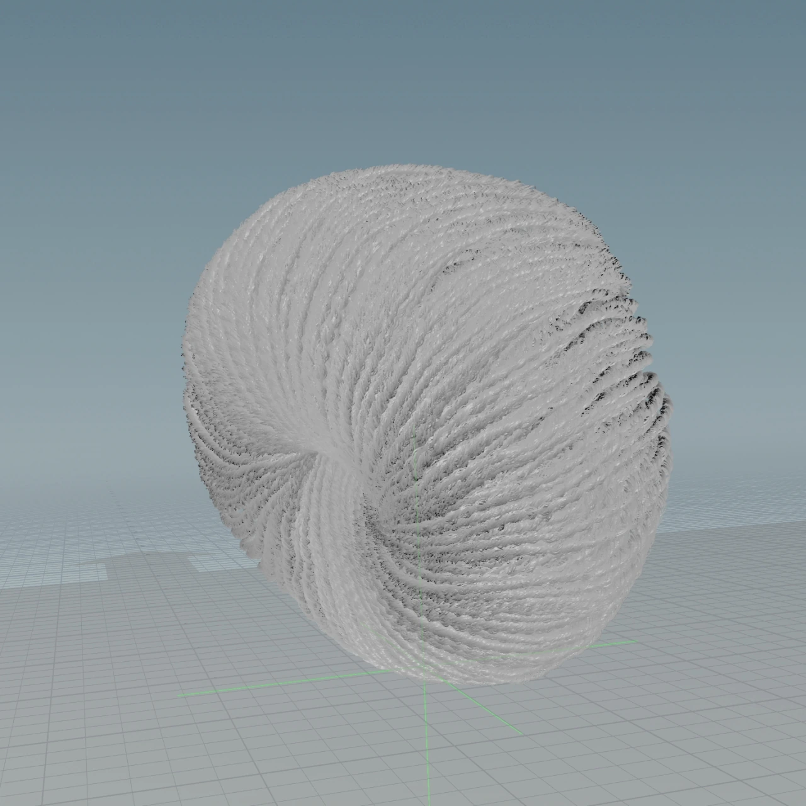</td>
    <td width="50%" valign="top">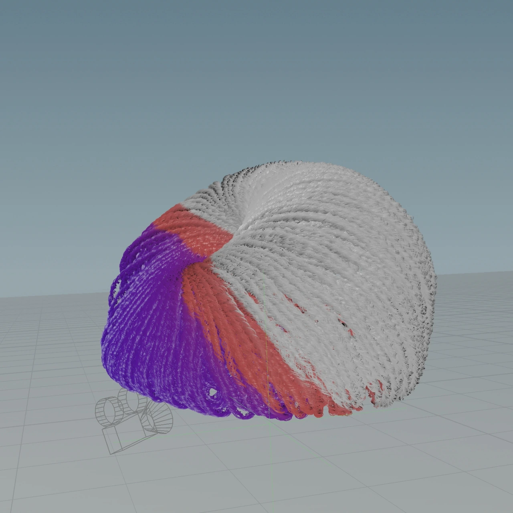</td>
  </tr>
  <tr>
    <td width="50%" valign="top">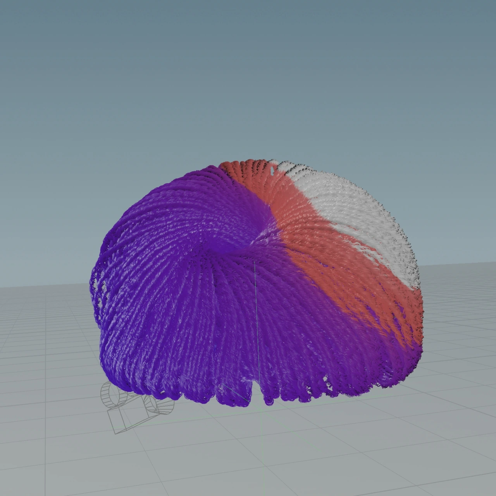</td>
    <td width="50%" valign="top">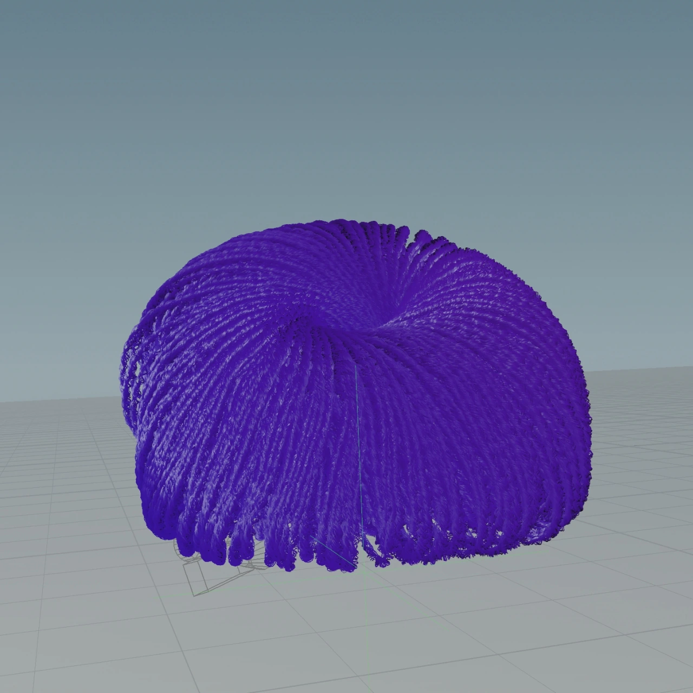</td>
  </tr>
</table>

<sub><strong>Yarn-ball progression.</strong> Four views track the same wrapped structure from a neutral strand study through localized color separation to the resolved surface state.</sub>

<table width="100%">
  <tr>
    <td width="50%" valign="top"></td>
    <td width="50%" valign="top"></td>
  </tr>
</table>

<sub><strong>Figure 05.3 — Material variation.</strong> Matched form and camera isolate color, clumping, density and flyaway length.</sub>

The wrapped-yarn ball and felted-fiber ball are different material hypotheses. The first makes the long strand path legible. The second emphasizes distributed fibers, contact, compression and surface recovery.

---

## 06 — Real material and simulated structure

The real-versus-3D plates are checkpoints in the construction process. Each comparison is tied to the same material form rather than treated as a general mood reference.


<sub><strong>Physical material reference.</strong> Surface softness, sparse flyaways, contact shadow and slight irregularity establish the visible behavior of a real felted volume.</sub>

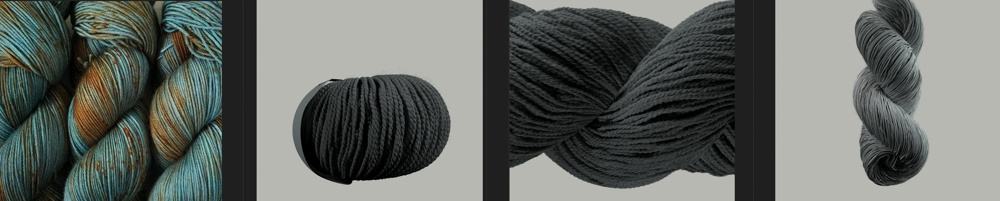

<sub><strong>Figure 06.1 — Representation across scale.</strong> Real hanks at left; a wound-yarn ball and two procedural hank studies compare path organization, density and bundle scale.</sub>

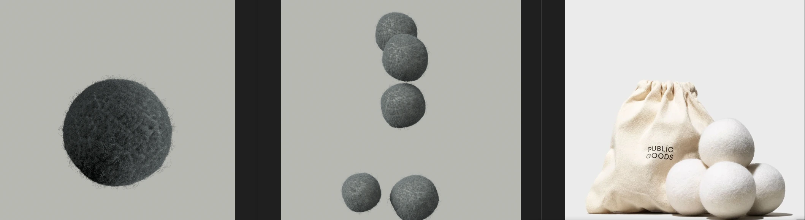

<sub><strong>Figure 06.2 — Surface correspondence.</strong> The single-ball-led crop compares outer-fiber density and surface breakup.</sub>


<sub><strong>Reference object.</strong> A manufactured set provides a restrained silhouette and packing reference for the procedural felted-ball studies.</sub>

<table width="100%">
  <tr>
    <td width="50%" valign="top">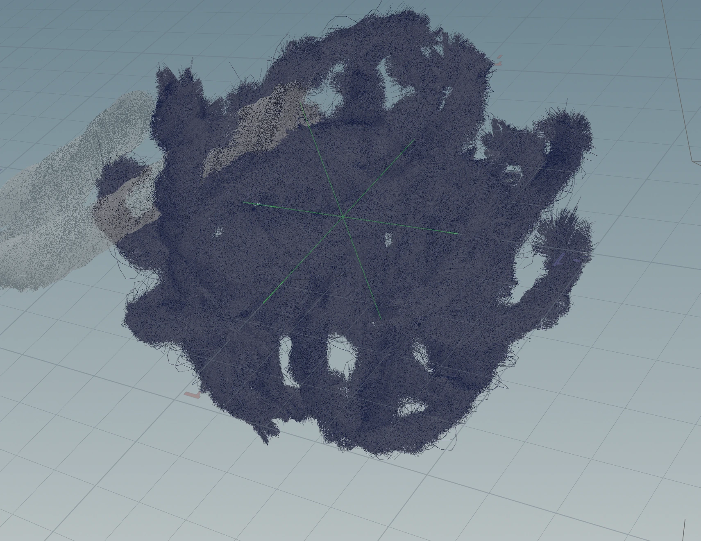</td>
    <td width="50%" valign="top">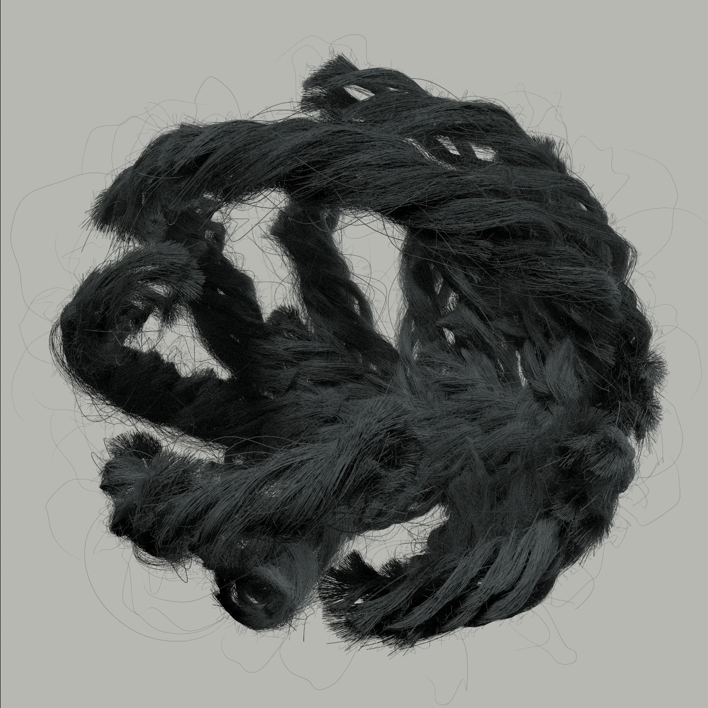</td>
  </tr>
</table>

<sub><strong>Captured material to processed form.</strong> The viewport state preserves the dense working structure; the render state resolves it into a legible fiber object.</sub>

The filenames use “cotton,” but the visible real reference is a set of felted wool dryer balls. These plates belong to the felted-fiber study. The exact infinity-yarn comparisons remain with the infinity-yarn system in Section 03.

Across the comparisons, the evaluation target is structure: continuity, packing, twist, local fiber distribution, contact and the material's possible response to force.

---

## 07 — Deformation as an experiment

The material simulations are controlled probes. They ask what changes when the same structure is compressed, released, collided, stretched or driven beyond its stable range.

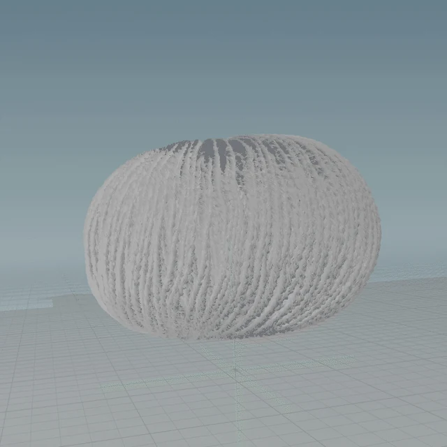

<sub><strong>Figure 07.1 — Shape response.</strong> A light yarn-ball support deforms while the dense visible fibers follow.</sub>

In the V8 render scene, `/obj/Wool_ball_setup/vellumconstraints2` stores stretch stiffness as mantissa `1`, stretch damping `0.001`, bend stiffness as `1 × 10^7`, bend damping `0.01`, stretch plasticity and breaking with threshold `0.01`. The solver uses self-collision, 100 constraint iterations, 10 collision passes and three post-collision passes, with gravity set to zero. Substeps change from one to two at frame 73.

The V9 single-ball scene changes bend stiffness to `1 × 10^-1` and disables stretch plasticity. The multicolor scene uses `1 × 10^-3` with plasticity. The ten-order bend range records look-development and response exploration; it is not a calibrated material model.

The visible fibers are generated and clumped after the lighter Vellum support is solved. This keeps the experiment tractable, but it means the simulation does not resolve every rendered filament-to-filament contact.

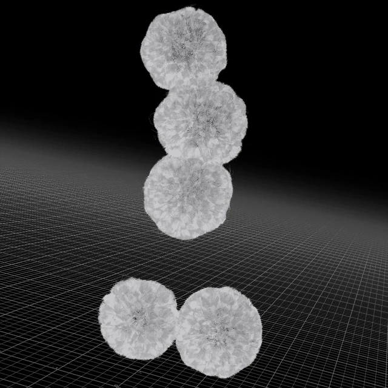

<sub><strong>Figure 07.2 — Contact response.</strong> Five fiber-rich balls collide and settle, exposing displacement and packing over time.</sub>

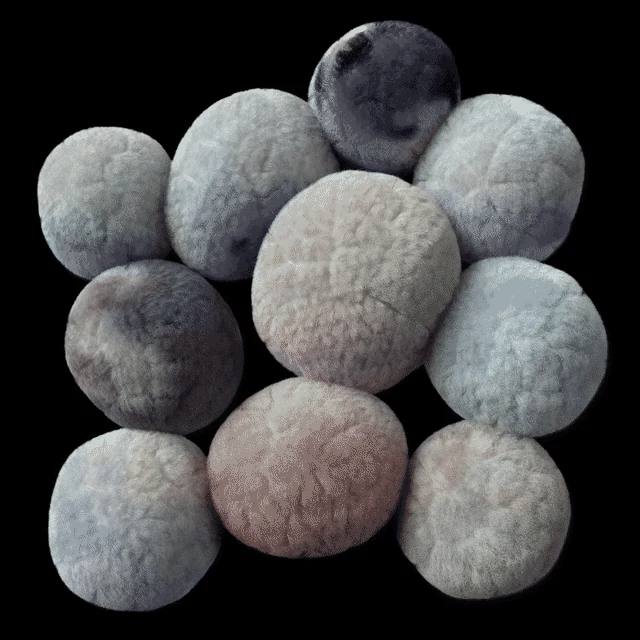

<sub><strong>Figure 07.3 — Collective packing.</strong> Ten wool balls redistribute contact across a denser system, exposing coordinated motion and local compression.</sub>


<sub><strong>Multi-ball material setup.</strong> Proxy arrangement and per-object shading make the collective simulation readable before final rendering.</sub>


<sub><strong>Figure 07.4 — Open guide state.</strong> Path separation makes continuity and strand identity visible.</sub>


<sub><strong>Figure 07.5 — Loose rendered state.</strong> Twist survives while bundle organization breaks down.</sub>

These open states document unraveling and loss of packing across guide and render representations. Compression and contact are explicit in the ball simulations; tensile loading and release are explicit in the cloth-and-stitch failure study that follows.

For a future robot experiment, the same trials could be paired with synchronized RGB/depth, end-effector pose, force/torque, motor current and contact audio. A model could then be asked to infer compliance, slip, packing state or an impending loss of support from the response history.

---

## 08 — Failure and changing topology


<sub><strong>Figure 08.1 — Real-world material reference.</strong> Layered, loosely woven samples establish the target language of soft folds, open weave, frayed edges and muted textile variation.</sub>

<table width="100%">
  <tr>
    <th width="33%">Early failure</th>
    <th width="33%">Propagating tear</th>
    <th width="33%">Released structure</th>
  </tr>
  <tr>
    <td width="33%" valign="top"></td>
    <td width="33%" valign="top"></td>
    <td width="33%" valign="top"></td>
  </tr>
</table>

<sub><strong>Figure 08.2 — Tear progression.</strong> Three matched clay renders expose the transition from localized damage to propagating separation and a substantially changed topology.</sub>

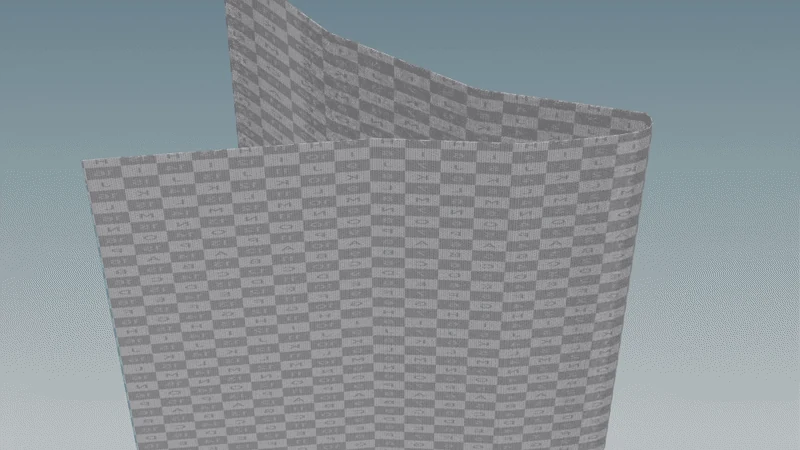

<sub><strong>Figure 08.3 — Failure as a signal.</strong> Load produces local separation; separation propagates; new free edges change the cloth's future motion.</sub>

The tearing study is independent from the procedural knitting prototype. It uses a separate cloth-and-thread setup to examine weak regions, constraint release and topology history.


<sub><strong>Figure 08.4 — Changed topology.</strong> The finished state preserves holes, new free edges, exposed layers and released fragments.</sub>

`/obj/etiquette/vellumcloth2` uses calculated varying mass and uniform thickness, with compression enabled and bend stiffness `1e-4`. `vellumstitch2` creates Stitch Points constraints on explicit point groups with mass `1`, thickness `0.01`, stretch stiffness `10,000`, damping `0.5` and rest length `0.1`. `vellumsolver2` uses two substeps, 100 constraint iterations, 10 smoothing iterations, 10 collision passes and three post-collision passes. A supporting POP network adds gravity `−9.80665 / 4` and wind `(2, 0.5, 0)`.

Weak and strong regions are authored from an attribute threshold:

```c
@group_weak = @weak < 0.2;
if (@group_weak)
    @strength = ch("weak");
else
    @strength = ch("strong");
```

Damage is detected by comparing current adjacency with the stored starting state:

```c
i@start_neighbours = len(neighbours(0, @ptnum));
i@sim_neighbours = len(neighbours(0, @ptnum));

int sim_n = point(1, "sim_neighbours", @ptnum);
i@blast = 0;
if (sim_n < i@start_neighbours)
    @blast = 1;
```

This comparison assumes matching point numbers between the two inputs. A production version should carry a persistent ID through caching or remeshing.

For machine perception, failure has several simultaneous signatures: a force peak and drop, rapid displacement, a vibration or sound transient, released constraints and a new visible edge. The scene demonstrates those physical events in simulation. It does not yet record them as a multimodal training set.

---

## 09 — From spatial intelligence to material intelligence

[World Labs' Atlas](https://www.worldlabs.ai/blog/atlas) places reconstruction, space-time simulation and robotics Real-to-Sim in one world-model context, including interactions with rigid, articulated and deformable objects. Its related [Real-to-Sim-to-Real work](https://www.worldlabs.ai/blog/real-to-sim-to-real) emphasizes simulations that preserve task-relevant observations and dynamics.

This project operates at a different scale. It moves inside the deformable object and asks what the material's own response can communicate:

| Spatial intelligence | Material intelligence in this study |
|---|---|
| Where is the object? | How is it internally connected? |
| How does the scene evolve? | How does this structure respond to a controlled action? |
| What would a camera or depth sensor observe? | What changes across geometry, resistance, slip and topology? |
| Can a task be reconstructed in simulation? | Which internal variables must be preserved for the response to remain useful? |

The link is conceptual. This repository is not part of Atlas, and it does not infer materials from images. It supplies controlled, inspectable experiments that could eventually complement world models with internal material state.

### Turning simulations into data

A machine-learning version of the study would need:

1. **Controlled trials** — fixed action trajectories across systematic stiffness, friction, density, topology and defect variations.
2. **Persistent state** — strand IDs, contact IDs, constraint history and damage events that survive caching.
3. **Synchronized observations** — image, depth, pose, displacement, force/torque, motor load, vibration and sound on one timeline.
4. **Matched real tests** — the same materials, actions and sensors outside Houdini, with uncertainty recorded.
5. **Held-out materials and actions** — evaluation on structures and interactions absent from training.

The useful target may be a latent material state: a compact representation that predicts the next response and helps choose the next safe action.

---

## Toward Adam 2.0

Adam 2.0 is the next experimental frame: an intelligent robot that learns material properties through interaction rather than relying on appearance alone.

The immediate path is concrete:

- turn procedural controls into documented experimental variables;
- expose solver and topology events as time-series outputs;
- reproduce a small set of pulls, compressions, slips and tears on physical material;
- train a model to predict response, damage state or action outcome;
- test whether adding material-response channels improves decisions beyond RGB/depth alone.

The frontier question remains open:

> **Can matter become a sensor—its deformation, resistance and failure forming a language an intelligent machine can learn?**

---

## Technical notebook

### Yarn construction details

The stochastic fiber populations in the inspected V7 graph use separate groups and noise scales:

| Node | Group | Amplitude | Element size |
|---|---|---:|---:|
| `mountain1` | `fuzzy1` | `0.098` | `0.02` |
| `mountain2` | `fuzzy2` | `0.03` | `0.1` |
| `mountain3` | `fuzzy3` | `0.049` | `0.02` |
| `mountain11` | `fuzzy3` | `0.007` | `0.02` |

The result is a distribution of strand behaviors rather than one noise texture pasted over the object.

Color is transferred from a lighter render guide with nearest-point lookup:

```c
int nearpt = nearpoint(1, @P);
vector color = point(1, "Cd", nearpt);
@Cd = color;
```

This is fast, but proximity is not correspondence: nearby strands can inherit each other's color. Persistent source-primitive and strand IDs would make the transfer stable under deformation.

Localized animation uses a binary spatial mask and procedural displacement:

```c
vector center = set(0, 0, 0);
float radius = chf("radius");
@mask = length(@P - center) < radius ? 1 : 0;
```

```c
float freq = chf("frequency");
float amp = chf("amplitude");
float noise_amp = chf("noise_amplitude");
float t = @Time * chf("speed");

if (@mask > 0) {
    float wave = sin(@P.x * freq + t) * amp;
    float noise = noise(@P * 0.1 + t) * noise_amp;
    @P.y += wave + noise;
}
```

Binary boundaries are useful for diagnosis but can reveal authored edges. A ramped influence or diffusion over connectivity would produce a smoother material response.

### Failure atlas

| Observed failure | Cause in the graph | Stronger experiment |
|---|---|---|
| twist without coherent packing | helix displacement alone does not preserve bundle cross-section | constrain the local frame and pack strands around a shared centerline |
| explosive geometry growth | nested sweeps occur before enough rejection | prune guides and populations before expansion; instance where possible |
| color jumps between strands | nearest-point lookup ignores identity | transfer by persistent strand/source ID |
| visible animation boundary | binary spatial mask | use a continuous falloff or graph diffusion |
| missing render/simulation branches | absolute external cache paths | package caches with relative `$HIP` paths and a manifest |

### Scene map

Node counts below exclude the root `/` node and were measured by loading every HIP in Houdini 19.5.493.

| Scene | Network nodes | What it contains |
|---|---:|---|
| [`03_Single_Infinity_Yarn_Fiber_Construction.hip`](./03_Single_Infinity_Yarn_Fiber_Construction.hip) | 344 | single curve-to-fiber yarn graph, stochastic populations, color and animation |
| [`03_Three_Strand_Infinity_Yarn_and_Lint_Render.hip`](./03_Three_Strand_Infinity_Yarn_and_Lint_Render.hip) | 912 | three strand systems, lint branches, localized controls and proxy-to-render transfer |
| [`04_Dynamic_Knitting_Grid_Prototype.hip`](./04_Dynamic_Knitting_Grid_Prototype.hip) | 25 | 20 × 20 layout prototype, 400 targets, alternating row lift and PolyWire output |
| [`04_Cached_Knit_Lace_and_Wool_Ball_Render_Setup.hip`](./04_Cached_Knit_Lace_and_Wool_Ball_Render_Setup.hip) | 901 | cached lace geometry and four wool-ball render branches; several branches depend on missing external caches and meshes |
| [`05_Yarn_Ball_Vellum_and_Fiber_Render.hip`](./05_Yarn_Ball_Vellum_and_Fiber_Render.hip) | 926 | wrapped-yarn construction, Vellum support, guide generation, clumping, hair materials and V-Ray outputs |
| [`05_Single_Wool_Ball_Vellum_and_Fiber_Setup.hip`](./05_Single_Wool_Ball_Vellum_and_Fiber_Setup.hip) | 670 | single-ball Vellum, Hair Generate, Guide Process, clumping and material studies |
| [`07_Multicolor_Ten_Wool_Ball_Vellum_Simulation.hip`](./07_Multicolor_Ten_Wool_Ball_Vellum_Simulation.hip) | 1,288 | ten-ball Vellum setup with multicolor fiber look development and V-Ray materials |
| [`08_Cloth_Tearing_and_Stitch_Failure.hip`](./08_Cloth_Tearing_and_Stitch_Failure.hip) | 550 | cloth/stitch constraints, weak regions, wind, adjacency damage and exposed threads |

### Original motion sources

The README GIFs are optimized excerpts. The original files remain unchanged:

- [`knitting_infity_yarn.avi`](./images/houdini_process/knitting_infity_yarn.avi) — procedural construction/interlacing sequence used for `yarn-motion-study.gif`.
- [`PB-Yarn-ball240.mov`](./images/houdini_process/PB-Yarn-ball240.mov) — yarn-ball deformation used for `yarn-deformation.gif`.
- [`fivewools.mov`](./images/houdini_process/fivewools.mov) — five-ball collision used for `vellum-contact.gif`.
- [`ten_wool_balls.mov`](./images/3d_renders/ten_wool_balls.mov) — dense ten-ball packing study used for `ten-wool-contact.gif`.
- [`cloth_tearing_video.mp4`](./images/Tear%20Propagation/cloth_tearing_video.mp4) — full tear sequence used for `material-failure.gif`.

---

## Opening the files

### Requirements

- Houdini `19.5.493` for the version used during inspection.
- V-Ray for Houdini for the V-Ray materials, lights and render-output networks.
- Sufficient memory for dense fiber branches; begin with display/render flags disabled on heavy geometry.

### Suggested route

1. Open [`04_Dynamic_Knitting_Grid_Prototype.hip`](./04_Dynamic_Knitting_Grid_Prototype.hip) for the smallest layout graph.
2. Open [`03_Single_Infinity_Yarn_Fiber_Construction.hip`](./03_Single_Infinity_Yarn_Fiber_Construction.hip) and inspect `/obj/thread7` from `line2` through `Out_Yarnad`.
3. Open [`05_Yarn_Ball_Vellum_and_Fiber_Render.hip`](./05_Yarn_Ball_Vellum_and_Fiber_Render.hip) and compare the Vellum support with post-simulation hair generation.
4. Open [`08_Cloth_Tearing_and_Stitch_Failure.hip`](./08_Cloth_Tearing_and_Stitch_Failure.hip) and inspect `/obj/strings_mesh`, `/obj/etiquette` and their Vellum/POP networks.

### Reproducibility boundary

The curated HIP copies retain their original scene contents; only their repository filenames changed. The original source HIP files outside this directory are untouched. Some render proxies, simulation caches, source meshes and textures use absolute `D:/SELF/...` or `E:/Knitting_CACHE/...` paths and are not committed. Cached branches may therefore load as placeholders or fail to recook. Repackage those dependencies under `$HIP`, add a cache manifest and store deterministic seeds before using the project as an experimental dataset.

---

## Media provenance

Every image and video embedded in this README comes from the repository. No web, stock or generated imagery was introduced for this update.

The six supplied comparison plates are used according to their visible content:

| Asset | Placement and meaning |
|---|---|
| [`real-infinity-yard-vs-3d.webp`](./images/real_vs_draft-render/real-infinity-yard-vs-3d.webp) | Section 03: real infinity/hank form versus two procedural versions |
| [`important_reference_vs_3d_to_include.webp`](./images/real_vs_draft-render/important_reference_vs_3d_to_include.webp) | exact green-hank reference beside its Houdini reconstruction |
| [`3d_threading_simulation.webp`](./images/real_vs_draft-render/3d_threading_simulation.webp) | digital threading, fiber hierarchy and open interlacing |
| [`real-vs-3d.webp`](./images/real_vs_draft-render/real-vs-3d.webp) | real hanks versus ball and hank representations across scale |
| [`real-cotton-ball_vs_3d.webp`](./images/real_vs_draft-render/real-cotton-ball_vs_3d.webp) | single-ball-led wool surface comparison |

Original project images are embedded directly throughout the visual body. The retained derivatives have a specific documentary role: `yarn-motion-study.webp`, `yarn-deformation.webp`, `vellum-contact.webp`, `ten-wool-contact.webp` and `material-failure.webp` preserve motion; `knit-prototype-cooked-geometry.webp` diagrams the inspected HDA topology. They are built by [`tools/build_material_intelligence_media.py`](./tools/build_material_intelligence_media.py) and [`tools/build_readme_visuals.py`](./tools/build_readme_visuals.py).

The earlier progression sheets and macro contact sheets remain available under [`docs/images`](./docs/images) but are no longer embedded in the main study. Their original source captures remain unchanged.

The real-image panels inside the supplied comparison plates do not contain recoverable source attribution in project filenames, metadata or notes. **Reference image. Original source not identified in project files.**

### Research context

- Eagleman, D. M. and Perrotta, M. V., [“The future of sensory substitution, addition, and expansion via haptic devices”](https://pubmed.ncbi.nlm.nih.gov/36712151/), 2023.
- Perrotta, M. V., Asgeirsdottir, T. and Eagleman, D. M., [“Deciphering Sounds Through Patterns of Vibration on the Skin”](https://pubmed.ncbi.nlm.nih.gov/33465416/), 2021.
- World Labs Team, [“Atlas: A World Model for Spatial Intelligence”](https://www.worldlabs.ai/blog/atlas), September 1, 2026.
- World Labs Team, [“Building Worlds That Train Robots”](https://www.worldlabs.ai/blog/real-to-sim-to-real), July 28, 2026.
