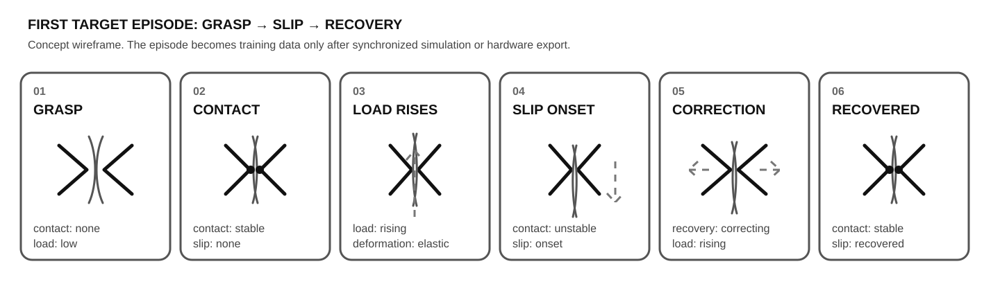

# Material interaction labels for LeRobot

This is a proposed frame-level annotation layer for a first Material Intelligence contribution to LeRobot. It is intentionally small: six categorical labels that describe physical state transitions a robot can observe and react to.



**Status:** schema drafted. No grasp episode has been exported as training data yet. The target is a gripper-and-material scene whose contact, load, slip and failure events are written from simulation state to the same timeline as observations and actions.

The labels are intended to be generated from measurable state, not guessed from appearance. In simulation, contact pairs, relative motion, constraint stretch or break events, and actuator/load signals can provide deterministic annotation rules.

[Episode template](../examples/lerobot/grasp-slip-recovery/episode-template.json)

## Label schema

| Label | Values | What it captures |
|---|---|---|
| `contact_state` | `none`, `stable`, `unstable` | Whether contact exists and whether it is holding reliably |
| `slip_state` | `none`, `onset`, `slipping`, `recovered` | The transition into slip, active slip, and recovery |
| `deformation_state` | `none`, `elastic`, `permanent` | Whether the material returns toward its prior shape or has changed irreversibly |
| `load_state` | `low`, `rising`, `high`, `dropping` | Coarse force or actuator-load trend over time |
| `failure_state` | `none`, `onset`, `failed` | The transition from intact structure toward material or constraint failure |
| `recovery_state` | `none`, `correcting`, `recovered` | Whether the controller is actively correcting and whether stability has been restored |

The highest-value labels for an initial material-interaction dataset are `slip_state`, `contact_state`, and `failure_state`. They describe transitions that can change the next robot action, rather than only describing appearance.

## Minimal episode

A first episode can be as small as:

```text
grasp -> contact -> load rises -> slip onset -> correction -> recovered
```

Example frame annotations:

```json
[
  {
    "frame": 0,
    "contact_state": "none",
    "slip_state": "none",
    "deformation_state": "none",
    "load_state": "low",
    "failure_state": "none",
    "recovery_state": "none"
  },
  {
    "frame": 12,
    "contact_state": "stable",
    "slip_state": "none",
    "deformation_state": "elastic",
    "load_state": "rising",
    "failure_state": "none",
    "recovery_state": "none"
  },
  {
    "frame": 24,
    "contact_state": "unstable",
    "slip_state": "onset",
    "deformation_state": "elastic",
    "load_state": "high",
    "failure_state": "none",
    "recovery_state": "none"
  },
  {
    "frame": 30,
    "contact_state": "unstable",
    "slip_state": "slipping",
    "deformation_state": "elastic",
    "load_state": "dropping",
    "failure_state": "none",
    "recovery_state": "correcting"
  },
  {
    "frame": 42,
    "contact_state": "stable",
    "slip_state": "recovered",
    "deformation_state": "elastic",
    "load_state": "rising",
    "failure_state": "none",
    "recovery_state": "recovered"
  }
]
```

These labels are a proposal for this project, not an official LeRobot schema. The next step is to attach them to synchronized observations from simulation or hardware so each episode contains action, state, sensor data, and physical-state labels on the same timeline.
